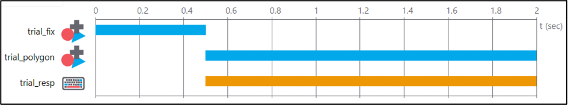
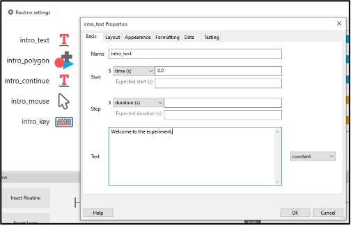

```{r setup, include=FALSE}
knitr::opts_chunk$set(echo = TRUE)
```

# Brief background to PsychoPy #

[PsychoPy](https://www.psychopy.org/) is a python library and GUI/builder for creating experiments. The builder allows you to assemble routines, components, and loops to produce an experiment, which automatically generates a Python script in the background using the PsychoPy library. The builder also attempts to translate the experiment into a related JavaScript library (PsychoJS), which allows researchers to run experiments online (usually via Pavlovia.org). Beyond the basic set of components (e.g., to present text and images, record keypresses etc.), you can also include custom “code components” in your builder project. This allows you to write code into your experiment directly and can help to overcome the inflexibility of the builder in some use cases. PsychoPy can attempt to auto-translate your custom code into JavaScript to facilitate running online, however sometimes it is necessary to make separate adjustments to the Python/Javascript side.

# Getting Started #

When you first download, install, and run PsychoPy, it will open three windows: the builder view, the coder view and the runner. The coder and runner can be closed for now (if we compile or run our code from the builder, the relevant window will re-open at that point anyway).

```{r, echo=FALSE, fig.cap="Fig. 1"}
knitr::include_graphics("img/img1.png")
```

## Builder ##

The builder is the main user-interface for PsychoPy, and is where you assemble components, routines and loops to construct the flow of your experiment.  

## Coder ##

PsychoPy also includes a basic Coding IDE, in which you can write experiments from scratch using the PsychoPy library. If you click “compile to python code”, PsychoPy will automatically generate a Python file and load this into the coder view. This shows you the code that the builder generates in the background, and you could make additional changes to the code here. Note that each time you click compile, it will create a new Python file in the name of your project, overwriting anything that was already in the project directory. Compiling is a one-way street – no changes made in the coder will reflect back into the builder project. In practice, viewing the code in the coder view is useful for debugging purposes, but there are rarely reasons to edit the code here. Code components in the Builder can be used to place chunks of code anywhere in the resulting Python file, and have the advantage of automatically translating the code to JavaScript/PsychoJS.

## Shell ##

The coder view also includes a shell in which you can start a python session and type in commands. This can be useful to test out the functionality of things you’re trying to achieve in custom code components (e.g., checking if a function works the way you expect it to), as it will return output on-the-fly.

At the outset, this shell does not have any packages loaded in that PsychoPy would normally import for you at the start of the experiment, so any functions from libraries will need to be imported first before they can be tested. The easiest way would be to copy and paste the entire “Import Packages” section from the start of the python file (see highlighted):

```{r, echo=FALSE, fig.cap="Fig. 2"}
knitr::include_graphics("img/img2.png")
```

For anything more complex than testing out basic mathematical operations, I will generally open the code in [PyCharm](https://www.jetbrains.com/products/compare/?product=pycharm&product=pycharm-ce) (the free community edition), where I can test out portions of code in a more user-friendly environment.

## Runner ##

When you click “Run experiment” from the builder view, PsychoPy will send your experiment to the Runner, and run the experiment. The runner will also provide logging information while the experiment is running. This can be useful for debugging, e.g., adding a print() command in a code component somewhere in your experiment, to check the value of a variable at that point in time.

```{r, echo=FALSE, fig.cap="Fig. 3"}
knitr::include_graphics("img/img3.png")
```

```{r, echo=FALSE, fig.cap="Fig. 4"}
knitr::include_graphics("img/img4.png")
```

## Getting Started: Section Summary ##

* The PsychoPy Builder allows you to build/code experiments efficiently.
* The builder can render a Python and/or JavaScript file, however, cannot do the reverse (open a code/.py file back into a builder project).
* The Coder and Runner can be useful for testing and debugging.
* In the background, the builder puts together the code for your experiment using the PsychoPy package.


# Experiment Settings and Preferences #

Settings and preferences can be located from the builder view. These are used to configure a few key aspects of PsychoPy’s behaviour:

## Preferences ##

Preferences are the default settings which span across PsychoPy experiments/projects. Here, you can set default values which will be adopted by experiment settings (e.g., which units to use for sizes and positions of stimuli, or which audio library to use for sound), as well as things like builder layout, theme and key-bindings. Note that aspects affecting the experiment itself will only apply if the Experiment Settings are set to “use preferences”. Otherwise, whatever is specified at that level will take precedence over whatever is set in preferences. In practice, I generally leave preferences at their default values.

```{r, echo=FALSE, fig.cap="Fig. 5", fig.show='hold',fig.align='center'}
knitr::include_graphics(c("img/img5a.png", "img/img5b.png"))
```

## Experiment Settings ##

The experiment settings window is used to configure things which affect the whole experiment, such as the background colour of the screen, the units used to determine stimuli sizes and positions, and the filename and type for data that will be saved.

```{r, echo=FALSE, fig.cap="Fig. 6"}
knitr::include_graphics("img/img6.png")
```

## Basic ##

Under the basic tab, you can find:

* Experiment name (best not to change this see [link]) 
*	Use version – this should only be used when running an experiment which 1) was created in an older version of PsychoPy and 2) does not run correctly
*	Enable escape key – this simply means the experiment will quit when the escape key was pressed, regardless of what else is going on
*	Info dialog and Experiment info fields
+	If enabled, the info dialog will pop up when you run your experiment
+ The default value will appear in the field, and can be changed by the user
+	The fields can be modified to have different names and give options to the user (do not remove the participant field, as this generally crashes psychopy)


*Example – in the Experiment Settings:*

```{r, echo=FALSE, fig.cap="Fig. 7"}
knitr::include_graphics("img/img7.png")
```

*Outcome:*

```{r, echo=FALSE, fig.cap="Fig. 8"}
knitr::include_graphics("img/img8.png")
```

Experiment info can be used to affect a variety of things within your experiment when paired with Python code. In the background, Experiment info creates a Python dictionary, which is a type of data that stores values retrievable by indexing [link to coding primer on indexing] with their associated “key”. In this case the Field becomes the Key, and the value supplied on the right becomes the value.

## Screen ##

```{r, echo=FALSE, fig.cap="Fig. 9"}
knitr::include_graphics("img/img9.png")
```

Most aspects of the screen needn’t to be changed for most use-cases. I usually run a 4k screen when experiment-building, so for debugging purposes will generally use a 1920x1080 window instead of running full-screen (meaning I have a window taking up ¼ of the screen, and can see any readout/errors in the runner). For actual data collection, full-screen optimises timings, and is always recommended.

Units specified here will apply to any components with “use experiment settings” as their units. I always keep the experiment settings as height units, as this is the most intuitive setting for running experiments online (i.e., where you lack control of the specific screen the experiment is being viewed on). Even for vision paradigms requiring stimuli to be specified precisely in degrees of visual angle or pixels, I still prefer to change these settings in the individual components and leave the overall setting as height units, as typically experiments will contain far more non-stimuli components needing height/position information than the stimuli of interest that to be exact.

## Experiment Settings and Preferences: Section Summary ##

*	Settings found in Preferences and Experiment Settings affect PsychoPy’s behaviour *throughout* the experiment
*	Units specified in individual components take precedence over both the Experiment Settings and Preferences


# Understanding the Tools of the PsychoPy Builder #

## Components ##

Everything that a participant interacts with during an experiment is achieved through the use of components. Components allow PsychoPy to interface with computer hardware, which includes displaying text or stimuli on the screen, playing sound through the speakers, or checking for responses via the keyboard/mouse. For example, a Stroop task would require a) a text component to display the stimulus, and b) a keyboard component to record the participants’ responses. 

## Routines ##

Before you can add components to your experiment, you need a routine to put them in. Routines are intervals of time within the experiment, in which a given set of components are set to occur. For example, a trial on which a) a fixation cross appears, b) a word appears, and c) the participant responds with a keypress, would be a routine containing three components. The ‘start’ and ‘stop’ parameters of the components determine the overall duration of the routine, which is reflected in the timeline.

```{r, echo=FALSE, fig.cap="Fig. 10"}

```

In the example above, the component “trial_fix” (fixation cross) is set to start at 0 seconds, and last for a duration of 0.5 seconds. The two subsequent components (a stimulus, and a keyboard response) are set to start at 0.5 seconds, and last for a duration of 1.5 seconds. Note that by default, the ‘stop’ parameter is set to “duration”, so specifies *how long* the stimulus will remain on-screen from its onset, rather than the end point on the timeline. 

The “Insert Routine” option on the left of the flow allows you to create new routines, or insert additional instances of existing ones. Where a single routine appears multiple times within an experiment, clicking any one instance of that routine within the flow will allow you to edit the routine, affecting the behaviour of the experiment wherever that routine appears.

```{r, echo=FALSE, fig.cap="Fig. 11"}
knitr::include_graphics("img/img11.png")
```

## Loops ##

On a basic level, loops allow you to repeat a routine or set of routines multiple times. Usually, a loop is paired with a conditions file, which is a spreadsheet whose rows are populated with information relating to conditions which should be present on a given trial. For example, the conditions file could specify the file paths of a series of images, which would then be displayed in-turn on each iteration of the loop. When choosing a conditions file, PsychoPy allows you to specify the order in which the rows of the sheet should appear. Usually, this is set to “random”, to present stimuli in a randomised order, however you could also use a loop to specify a set of conditions which may need to be completed in a specific order. When used creatively, loops can also be a powerful way to change the flow of your task. The parameter “nReps” within a loop can be set using a variable which could be specified in your conditions file so, on a given iteration of the loop, you could determine which routines will or will not run by setting a series of variables to 0 and 1.

## Flow ##

The experiment flow visualization at the bottom of the PsychoPy builder shows all of the routines and loops that will occur in your experiment, in the order that they will occur. It allows you to:
*	Create/remove routines
*	Create/remove loops
*	Insert additional copies of existing routines (e.g., a trial that appears both in a practice block and in the main experimental block)
*	Copy and paste routines (ctrl+shift+c, ctrl+shift+v)
+	This creates a separate copy of the routine and will prompt you to give the routine a new name. This is different to adding a copy of the same routine, in which case any changes would be reflected in *all* instances of that routine.


# Best practice, Examples and Useful to know #

## Best Practice ##

As you have variables/names coming from multiple sources and appearing in multiple places, it’s important to consider naming schemes. I usually use underscores for all component names with reference to the routine they belong to (e.g., “setup_code” in “setup” routine).

Often you will have a conditions file (or multiple conditions files) to set task parameters/conditions for your experiment. Generally, each row of the excel sheet is one trial of your experiment. The column names are interpreted by PsychoPy as a variable, whose values changes on each new trial to whatever is on the corresponding row. As a result, make sure these variable names are not used elsewhere in your experiment. With more complex designs, I tend to use different naming conventions in the conditions files compared to elsewhere (e.g., underscores in conditions files [which_task, image_stim] and component names [setup_code], versus in custom code components [fixationDur, stimDur].

## Examples: ##

*Circle – left/right to control its rotation
	Example of: using trig to calculate position for circle
	
*Different flow using loops (loops activate/deactivate different routines each repeat)

*Working out the correct response using logic

*Randomising beyond the constraints of loops (special randomise function)

*Basic staircase design using code

*Debugging example – switchable debugging mode, keypress skip etc.

*Adding custom data to your experiment (variable number of columns)

## Useful to know: ##

With two experiments open at once, you can copy and paste routines between them by using ‘ctrl+shift+c’ and ‘ctrl+shift+v’.

Setting a list as equal to a list (new_list = old_list) does not create a separate copy of the list, but rather makes a reference to the original list. Using operations like “shuffle()” will affect both the old and the new list.

If you import the ‘random’ library, be careful as some functions share names with the ‘numpy.random’ library that PsychoPy imports by default. The Auto>JS translator recognises both randint() functions (which behave differently), which can in some cases lead to unexpected behaviour online vs. offline.

When making a copy of your experiment project, or renaming it for any reason, be aware that this will create a mis-match between the filename of the experiment (i.e., the name of the .psyexp file), and the “experiment name” which appears under settings. The JavaScript file PsychoPy creates will adopt the name of the .psyexp file, however when testing the experiment in-browser it will get stuck on “initialising” because it’s looking for a .js file named after the experiment name as it appears in the settings.

To test running an experiment online, there is no need to sync the project to Pavlovia in the first instance. Instead you can 1) use the “Compile to JS script” button in the builder to create all the necessary files for the JavaScript version of the experiment, and 2) Click “Run in Local Browser” to run the JavaScript experiment on your machine.

The way an experiment appears online vs. offline always seems to differ at least slightly. For example, the default font for text components gets replaced by a serif font online. Visuals in general (text and images) will generally appear slightly different due to how the JS side handles edges/aliasing.

# Basic coding and the Python language #

This section will cover some basic coding concepts in the Python language to provide a primer on how to use custom code components to optimise your experiment or overcome limitations.

## Overview ##

It is useful to understand a couple of basic things about Python before considering the general coding concepts around experiment building.

## Object-Oriented Programming ##

Python is an object-oriented language, meaning that it is broadly organised around *objects* which are examples of *classes*. Classes are categories of objects with a set of attributes, so individual objects may share the same class but possess different attributes. Therefore, every component in the PsychoPy builder is a class, and each time you place a new component into the experiment, you are essentially creating a new object whose class is that of the component type. For example, a basic text component would be an object of the class “TextStim”, whose attributes include things like the text, position, colour, font and size.

```{r, echo=FALSE, fig.cap="Fig. 12"}

```

    --- Initialize components for Routine "intro" ---
    intro_text = visual.TextStim(win=win, name='intro_text',
        text='Welcome to the experiment.',
        font='Open Sans',
        pos=(0, 0), height=0.05, wrapWidth=None, ori=0.0, 
        color=“white”, colorSpace='rgb', opacity=None, 
        languageStyle='LTR',
        depth=0.0);
        
## Indenting ##

Python is strict about indenting and will not run a piece of code if logic statements, loops etc. are not nested correctly with blank space.

## Flexible typing ##

Python is a ‘flexibly typed’ language, so it tends to permit the use of a variety of different data types for the purposes of logic statements. For example, 1 could be an integer – 1 – or a string – “1” – and logical statements would still consider these to match (e.g., 1 == “1” returns True). Similarly, a Boolean (a data type that can only be either “True” or “False”) would be evaluated the same as a variable whose value is 0 or 1 in number format, as far as logic statements are concerned. The reason this is important to understand, is that the Auto>JS translation always translates logic statements with ‘strict type-checking’ meaning it uses a three equal signs === to reflect that it is evaluating not only whether the values match (e.g., 1 is equal to “1” or True), but that the data types match as well. This can lead to scenarios where the Python and JS experiments would run differently.

## Variables ##

Ignoring different data types and classes for now, a variable is a name which represents a piece of data whose value can be changed.

For example, the statement ‘x = 1’ tells Python to create a variable called x, with a value of 1.

```{r, echo=FALSE, fig.cap="Fig. 13"}
knitr::include_graphics("img/img13.png")
```

In the above example, the variable “x” is created and assigned the value to the right of the equals sign. Running the print command – print(x) –returns the value of x. Then, its value is updated, and re-running the print command returns this new value.

## Lists ##

Lists are Python objects which can be used to store a sequence of values. They can be extremely useful for randomisation, as the method “shuffle” can be used to randomise the order of the list.

## Dictionaries ##

Dictionary objects are similar to lists, however instead of indexing through the position within the sequence, each value has an associated “Key” that is used to retrieve it. Dictionaries are created using curly braces “{}”.

```{r, echo=FALSE, fig.cap="Fig. 14"}
knitr::include_graphics("img/img14.png")
```

## Indexing ##

Indexing is used to retrieve values from a list, tuple or dictionary object.

Indexing from a nested list:

```{r, echo=FALSE, fig.cap="Fig. 15"}
knitr::include_graphics("img/img15.png")
```

In this example, we’re indexing the 2nd element from the 0th list (this is the third position of the first list, as Python indexes from 0) 

## Logical Operations ##

Logical statements are used to vary which lines of code will run based on a condition or set of conditions. A given logical statement will return either True or False, and only execute the nested portion of code if True.

```{r, echo=FALSE, fig.cap="Fig. 16"}
knitr::include_graphics("img/img16.png")
```

Python requires the logic statement to be followed by a colon, and the code within the statement to be indented. Multiple conditions can be checked using “and” or “or”.

“elif” is a shorthand to reduce the need for nesting many statements. It allows you to specify an alternative logic test in-line with the previous, to be checked if the first returns False. 

## Functions ##

## Loops ##

Although the PsychoPy builder will handle loops insofar as running sets of trials and/or blocks (often in a randomised order), there are many situations where it is useful to use loops in custom code. Here I will cover two types of loops – ‘for’ loops and ‘while’ loops:

### 'For' Loops ###

A For loop tells Python to execute a piece of code a specific number of times. Generally, the loop is set up to have some form of indexing variable change in value on each iteration of the loop:

Usually a loop is set up like:

For i in range(4):
	print(i)
or
my_list = [0, 1, 2, 3]
for I in range(len(my_list))
	print(i)
	
where the function “range” creates a “range” object which facilitates iterating the loop the number of times specified by the argument of the range function

you can also set up a for loop to affect the items in a list. In the following example, a list of coordinates is looped through to subtract a fixed value from the x coordinate (the 0th element of the nested list comprising the coordinates). In each iteration of the loop, the variable “pos” represents the item within the list and is used to index and change the desired coordinate:

```{r, echo=FALSE, fig.cap="Fig. 17"}
knitr::include_graphics("img/img17.png")
```

### 'While' Loops ###

While loops do not execute a fixed number of times like ‘For’ loops, but instead keep re-running the set of code until a condition is satisfied:

```{r, echo=FALSE, fig.cap="Fig. 18"}
knitr::include_graphics("img/img18.png")
```

In the example above, the goal is to ensure the colour of a target stimulus doesn’t match that of a prime stimulus, so a variable called target_stimulus_colour (this could be a string “grey”, or set of rbg values [128, 128, 128]) is compared against a similar variable called prime_stimulus_colour. If, and for as long as, the logical statement returns true (i.e., the colours match) the chunk of code inside the while loop keeps re-running. In this case, shuffling a list of colours (e.g., [“grey”, “red”, “blue”, “green”]) and then choosing the 0th element of this shuffled list as the target colour.

# Online Experiments #

## Before you upload – setup and testing ##

Ensure resources are specified (PsychoPy knows about the ones you reference, but not ones set via code/variables)

Test in local browser, check for issues using ctrl+shift+i in chrome

## Uploading to Pavlovia ##

Ensure “experiment name” (in settings) and name of .psyexp file match. Sync to a new project, pilot or test

## Linking from Prolific/Qualtrics ##

Passing variables through the URL etc.