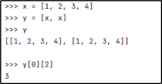
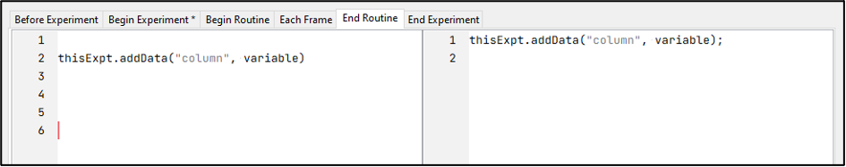

```{r setup, include=FALSE}
knitr::opts_chunk$set(echo = TRUE)
```

# Brief background to PsychoPy #

[PsychoPy](https://www.psychopy.org/) is a python library and GUI/builder for 
creating experiments. The builder allows you to assemble routines, components, 
and loops to produce an experiment, which automatically generates a Python script 
in the background using the PsychoPy library. The builder also attempts to 
translate the experiment into a related JavaScript library (PsychoJS), which 
allows researchers to run experiments online (usually via Pavlovia.org). Beyond 
the basic set of components (e.g., to present text and images, record keypresses 
etc.), you can also include custom “code components” in your builder project. 
This allows you to write code into your experiment directly and can help to overcome
the inflexibility of the builder in some use cases. PsychoPy can attempt to 
auto-translate your custom code into JavaScript to facilitate running online, 
however sometimes it is necessary to make separate adjustments to the 
Python/Javascript side.

# Getting Started #

When you first download, install, and run PsychoPy, it will open three windows: 
the builder view, the coder view and the runner. The coder and runner can be 
closed for now (if we compile or run our code from the builder, the relevant 
window will re-open at that point anyway).

```{r, echo=FALSE, fig.cap="Fig. 1"}

```

## Builder ##

The builder is the main user-interface for PsychoPy, and is where you assemble 
components, routines and loops to construct the flow of your experiment.  

## Coder ##

PsychoPy also includes a basic Coding IDE, in which you can write experiments 
from scratch using the PsychoPy library. If you click “compile to python code”, 
PsychoPy will automatically generate a Python file and load this into the coder 
view. This shows you the code that the builder generates in the background, and 
you could make additional changes to the code here. Note that each time you 
click compile, it will create a new Python file in the name of your project, 
overwriting anything that was already in the project directory. Compiling is a 
one-way street – no changes made in the coder will reflect back into the builder 
project. In practice, viewing the code in the coder view is useful for debugging 
purposes, but there are rarely reasons to edit the code here. Code components in 
the Builder can be used to place chunks of code anywhere in the resulting Python 
file, and have the advantage of automatically translating the code to JavaScript/PsychoJS.

### Shell ###

The coder view also includes a shell in which you can start a python session and 
type in commands. This can be useful to test out the functionality of things 
you’re trying to achieve in custom code components (e.g., checking if a function 
works the way you expect it to), as it will return output on-the-fly.

At the outset, this shell does not have any packages loaded in that PsychoPy 
would normally import for you at the start of the experiment, so any functions 
from libraries will need to be imported first before they can be tested. The 
easiest way would be to copy and paste the entire “Import Packages” section 
from the start of the python file (see highlighted):

```{r, echo=FALSE, fig.cap="Fig. 2"}

```

For anything more complex than testing out basic mathematical operations, I will
generally open the code in 
[PyCharm](https://www.jetbrains.com/products/compare/?product=pycharm&product=pycharm-ce) 
(the free community edition), where I can test out portions of code in a more 
user-friendly environment.

## Runner ##

When you click “Run experiment” from the builder view, PsychoPy will send your 
experiment to the Runner, and run the experiment. The runner will also provide 
logging information while the experiment is running. This can be useful for 
debugging, e.g., adding a print() command in a code component somewhere in your 
experiment, to check the value of a variable at that point in time.

```{r, echo=FALSE, fig.cap="Fig. 3"}

```

```{r, echo=FALSE, fig.cap="Fig. 4"}

```

## Getting Started: Section Summary ##

* The PsychoPy Builder allows you to build/code experiments efficiently.
* The builder can render a Python and/or JavaScript file, however, cannot do 
the reverse (open a code/.py file back into a builder project).
* The Coder and Runner can be useful for testing and debugging.
* In the background, the builder puts together the code for your experiment 
using the PsychoPy package.


# Experiment Settings and Preferences #

Settings and preferences can be located from the builder view. These are used 
to configure a few key aspects of PsychoPy’s behaviour:

## Preferences ##

Preferences are the default settings which span across PsychoPy 
experiments/projects. Here, you can set default values which will be adopted by 
experiment settings (e.g., which units to use for sizes and positions of 
stimuli, or which audio library to use for sound), as well as things like 
builder layout, theme and key-bindings. Note that aspects affecting the 
experiment itself will only apply if the *Experiment Settings* are set to 
“use preferences”. Otherwise, whatever is specified at that level will take 
precedence over whatever is set in preferences. In practice, I generally leave 
preferences at their default values.

```{r, echo=FALSE, fig.cap="Fig. 5", fig.show='hold',fig.align='center'}
knitr::include_graphics(c("img/img5a.png", "img/img5b.png"))
```

## Experiment Settings ##

The experiment settings window is used to configure things which affect the 
whole experiment, such as the background colour of the screen, the units used 
to determine stimuli sizes and positions, and the filename and type for data 
that will be saved.

```{r, echo=FALSE, fig.cap="Fig. 6"}

```

### Basic ###

Under the basic tab, you can find:

* Experiment name (best not to change this see [link]) 
*	Use version – this should only be used when running an experiment which 1) 
was created in an older version of PsychoPy and 2) does not run correctly
*	Enable escape key – this simply means the experiment will quit when the escape
key was pressed, regardless of what else is going on
*	Info dialog and Experiment info fields
+	If enabled, the info dialog will pop up when you run your experiment
+ The default value will appear in the field, and can be changed by the user
+	The fields can be modified to have different names and give options to the 
user (do not remove the participant field, as this generally crashes psychopy)


*Example – in the Experiment Settings:*

```{r, echo=FALSE, fig.cap="Fig. 7"}

```

*Outcome:*

```{r, echo=FALSE, fig.cap="Fig. 8"}
knitr::include_graphics("img/img8.png")
```

Experiment info can be used to affect a variety of things within your experiment
when paired with Python code. In the background, Experiment info creates a 
Python dictionary, which is a type of data that stores values retrievable by 
indexing [link to coding primer on indexing] with their associated “key”. In 
this case the Field becomes the Key, and the value supplied on the right becomes
the value.

### Screen ###

```{r, echo=FALSE, fig.cap="Fig. 9"}

```

Most aspects of the screen needn’t to be changed for most use-cases. I usually 
run a 4k screen when experiment-building, so for debugging purposes will 
generally use a 1920x1080 window instead of running full-screen (meaning I have 
a window taking up ¼ of the screen, and can see any readout/errors in the runner). 
For actual data collection, full-screen optimises timings, and is always recommended.

Units specified here will apply to any components with “use experiment settings”
as their units. I always keep the experiment settings as height units, as this
is the most intuitive setting for running experiments online (i.e., where you 
lack control of the specific screen the experiment is being viewed on). Even 
for vision paradigms requiring stimuli to be specified precisely in degrees of
visual angle or pixels, I still prefer to change these settings in the 
individual components and leave the overall setting as height units, as 
typically experiments will contain far more non-stimuli components needing 
height/position information than the stimuli of interest that to be exact.

## Experiment Settings and Preferences: Section Summary ##

*	Settings found in Preferences and Experiment Settings affect PsychoPy’s 
behaviour *throughout* the experiment
*	Units specified in individual components take precedence over both the 
Experiment Settings and Preferences


# Understanding the Tools of the PsychoPy Builder #

## Components ##

Everything that a participant interacts with during an experiment is achieved 
through the use of components. Components allow PsychoPy to interface with 
computer hardware, which includes displaying text or stimuli on the screen, 
playing sound through the speakers, or checking for responses via the 
keyboard/mouse. For example, a Stroop task would require a) a text component 
to display the stimulus, and b) a keyboard component to record the participants’
responses. 

Components can be set up to use fixed parameters which do not change throughout 
the experiment (e.g., a set of instructions which will appear once, or a fixation 
cross which will always display a cross for the same amount of time), or can be
manipulated by variables which are set to update over time (e.g., different 
images being displayed on different trials).

### Setting parameters through variables ###

Parameters of components which need to change over time can be set through 
variables (either created through code components or specified in a conditions 
file, PsychoPy needs to be told that these are variables and not plain text. 
This is achieved by placing a dollar symbol “$” before the variable name.

It is also important to check the frequency with which the variable is expected 
to update. By default, many parameters are set to “Constant”, meaning the value 
specified in the field is set at the start of the experiment and will not change 
for the duration. Where variables are used to affect values every trial (i.e., 
each time a loop iterates), this should be set to “Every Repeat”. The third 
option is “Every Frame”, which means PsychoPy will set the current value of that 
parameter every time the screen refreshes (typically 60 times per second, or ~16.66ms).
This is necessary when you need things to change in real-time (e.g., a clock 
displaying the current time, or polygon(s) moving around the screen).

```{r, echo=FALSE, fig.cap="Fig. 10a"}

```

The Position parameter already has a $ sign before it (as it’s expecting a list 
or tuple as an input, which would already be formatted in acceptable python syntax). 
Here we would be setting the variable currentPos to update each frame, and 
could then run some calculations in the “Each Frame” tab of a code component 
to determine this position.

## Routines ##

Before you can add components to your experiment, you need a routine to put 
them in. Routines are intervals of time within the experiment, in which a given
set of components are set to occur. For example, a trial on which a) a fixation
cross appears, b) a word appears, and c) the participant responds with a 
keypress, would be a routine containing three components. The ‘start’ and ‘stop’
parameters of the components determine the overall duration of the routine, 
which is reflected in the timeline.

```{r, echo=FALSE, fig.cap="Fig. 10b"}
knitr::include_graphics("img/img10b.png")
```

In the example above, the component “trial_fix” (fixation cross) is set to 
start at 0 seconds, and last for a duration of 0.5 seconds. The two subsequent 
components (a stimulus, and a keyboard response) are set to start at 0.5 seconds,
and last for a duration of 1.5 seconds. Note that by default, the ‘stop’ 
parameter is set to “duration”, so specifies *how long* the stimulus will 
remain on-screen from its onset, rather than the end point on the timeline. 

The “Insert Routine” option on the left of the flow allows you to create new 
routines, or insert additional instances of existing ones. Where a single 
routine appears multiple times within an experiment, clicking any one instance 
of that routine within the flow will allow you to edit the routine, affecting 
the behaviour of the experiment wherever that routine appears.

```{r, echo=FALSE, fig.cap="Fig. 11"}
knitr::include_graphics("img/img11.png")
```

## Loops ##

Loops allow you to repeat a routine or set of routines multiple times 
(e.g., to run a block of trials). Usually, a loop contains a conditions file, 
which is a spreadsheet (excel or csv) whose rows are populated with information 
relating to conditions which should be present on a given trial. The column 
names (first row of the conditions file) become the names of variables, and 
subsequent rows contain information about what the values of those variables 
should be. For example, the conditions file could specify the file paths of a 
series of images, which would then be displayed in-turn on each iteration of 
the loop.

When creating a loop, PsychoPy allows you to specify the order in which the 
rows of the conditions file should appear. By default, this is set to “random”,
to present stimuli in a randomised order, however there are situations where you
might want this to be sequential (e.g., you could have an outer loop for blocks, 
which are completed in a specific order, and an inner loop for the trials within
the blocks which occur in a random order).

When used creatively, loops can also be a powerful way to change the flow of 
your task. The parameter “nReps” within a loop can be set using a variable 
(e.g., value of 0 or 1) to manipulate whether a given loop will run at all.


## Flow ##

The experiment flow visualization at the bottom of the PsychoPy builder shows 
all of the routines and loops that will occur in your experiment, in the order 
that they will occur. It allows you to:
*	Create/remove routines
*	Create/remove loops
*	Insert additional copies of existing routines (e.g., a trial that appears both 
in a practice block and in the main experimental block)
*	Copy and paste routines (ctrl+shift+c, ctrl+shift+v)
+	This creates a *separate* copy of the routine and will prompt you to give the 
routine a new name. This is different to adding a copy of the same routine, in 
which case any changes would be reflected in *all* instances of that routine.


# Best practice, Examples and Useful to know #

## Best Practice ##

As you have variables/names coming from multiple sources and appearing in 
multiple places, it’s important to consider naming schemes. I usually use 
underscores for all component names with reference to the routine they belong 
to (e.g., “setup_code” in “setup” routine).

Often you will have a conditions file (or multiple conditions files) to set 
task parameters/conditions for your experiment. Generally, each row of the 
excel sheet is one trial of your experiment. The column names are interpreted 
by PsychoPy as a variable, whose values changes on each new trial to whatever 
is on the corresponding row. As a result, make sure these variable names are 
not used elsewhere in your experiment. With more complex designs, I tend to use 
different naming conventions in the conditions files compared to elsewhere 
(e.g., underscores in conditions files [which_task, image_stim] and component 
names [setup_code], versus in custom code components [fixationDur, stimDur].

## Examples: ##

*Circle – left/right to control its rotation
	Example of: using trig to calculate position for circle
	
*Different flow using loops (loops activate/deactivate different routines each repeat)

*Working out the correct response using logic

*Randomising beyond the constraints of loops (special randomise function)

*Basic staircase design using code

*Debugging example – switchable debugging mode, keypress skip etc.

*Adding custom data to your experiment (variable number of columns)

## Useful to know: ##

With two experiments open at once, you can copy and paste routines between them 
by using ‘ctrl+shift+c’ and ‘ctrl+shift+v’.

Setting a list as equal to a list (new_list = old_list) does not create a 
separate copy of the list, but rather makes a reference to the original list. 
Using operations like “shuffle()” will affect both the old and the new list.

If you import the ‘random’ library, be careful as some functions share names 
with the ‘numpy.random’ library that PsychoPy imports by default. The Auto>JS 
translator recognises both randint() functions (which behave differently), 
which can in some cases lead to unexpected behaviour online vs. offline.

When making a copy of your experiment project, or renaming it for any reason,
be aware that this will create a mis-match between the filename of the 
experiment (i.e., the name of the .psyexp file), and the “experiment name” 
which appears under settings. The JavaScript file PsychoPy creates will adopt 
the name of the .psyexp file, however when testing the experiment in-browser it
will get stuck on “initialising” because it’s looking for a .js file named after
the experiment name as it appears in the settings.

To test running an experiment online, there is no need to sync the project to 
Pavlovia in the first instance. Instead you can 1) use the “Compile to JS script”
button in the builder to create all the necessary files for the JavaScript 
version of the experiment, and 2) Click “Run in Local Browser” to run the 
JavaScript experiment on your machine.

The way an experiment appears online vs. offline always seems to differ at 
least slightly. For example, the default font for text components gets replaced 
by a serif font online. Visuals in general (text and images) will generally 
appear slightly different due to how the JS side handles edges/aliasing.

# Basic coding and the Python language #

This section will cover some basic coding concepts in the Python language to 
provide a primer on how to use custom code components to optimise your experiment 
or overcome limitations. The first three projects will not draw greatly on what 
is covered here, but project 4 will use *all* of these concepts to illustrate how 
they are practically implemented in day-to-day experiment building.

## Overview ##

It is useful to understand a couple of basic things about Python before 
considering the general coding concepts around experiment building.

## Object-Oriented Programming ##

Python is an object-oriented language, meaning that it is broadly organised 
around *objects* which are examples of *classes*. Classes are categories of 
objects with a set of attributes, so individual objects may share the same 
class but possess different attributes. Therefore, every component in the 
PsychoPy builder is a class, and each time you place a new component into the 
experiment, you are essentially creating a new object whose class is that of the
component type. For example, a basic text component would be an object of the 
class “TextStim”, whose attributes include things like the text, position, 
colour, font and size. 

While the front-end of the PsychoPy builder makes it easy to determine how and 
when things should change in your components (e.g., update text each time the 
routine repeats), in the background, the code is using methods[Methods] to adjust 
the parameters of these objects. Using code, it is possible to bypass what’s happening 
in the component, by using methods which update the object directly 
(e.g., intro_text.setText(“new text”). This is what PsychoPy is already doing in 
the background, with the component settings just determining where in the code 
it should occur.

```{r, echo=FALSE, fig.cap="Fig. 12a"}
knitr::include_graphics("img/img12a.png")
```

    --- Initialize components for Routine "intro" ---
    intro_text = visual.TextStim(win=win, name='intro_text',
        text='Welcome to the experiment.',
        font='Open Sans',
        pos=(0, 0), height=0.05, wrapWidth=None, ori=0.0, 
        color=“white”, colorSpace='rgb', opacity=None, 
        languageStyle='LTR',
        depth=0.0);
        
## Indenting ##

Python is strict about indenting and will not run a piece of code if logic 
statements, loops etc. are not nested correctly with blank space. Code components
will indent to the correct level when pressing the return key, however don’t 
offer a convenient way to quickly re-indent code or show errors in indenting 
(e.g., when copying and pasting code). The easiest way to keep tabs is to look 
at the automatic JavaScript translation, which will show an error if there are 
any issues in your python code.

```{r, echo=FALSE, fig.cap="Fig. 12b"}

```

In this example, x = 999 (in the ‘elif’ portion of the statement) should be 
indented. As a result, the auto-translation has recognised that there is a 
syntax error.

## Flexible typing ##

Python is a ‘flexibly typed’ language, so isn’t especially strict about data 
types. For example, using numbers 0 and 1 in place of true Booleans (a data 
type that can be either True or False) is permitted in logic statements. The 
reason this is important to understand, is that the Auto>JS translation always 
translates logic statements with ‘strict type-checking’ meaning it uses a three 
equal signs === to reflect that it is evaluating not only whether the values 
match (e.g., 1 is equal True), but that the data types match as well. This can 
lead to scenarios where the Python and JS experiments would run differently.

## Variables ##

Ignoring different data types and classes for now, a variable is a name which 
represents a piece of data whose value can be changed.

For example, the statement ‘x = 1’ tells Python to create a variable called x,
with a value of 1.

```{r, echo=FALSE, fig.cap="Fig. 13"}

```

In the above example, the variable “x” is created and assigned the value to the 
right of the equals sign. Running the print command – print(x) –returns the 
value of x. Then, its value is updated, and re-running the print command returns 
this new value.

## Lists ##

Lists are Python objects which can be used to store a sequence of values. 
They can be extremely useful for randomisation, as the method “shuffle” can be 
used to randomise the order of the list.

## Dictionaries ##

Dictionary objects are similar to lists, however instead of indexing through the
position within the sequence, each value has an associated “Key” that is used 
to retrieve it. Dictionaries are created using curly braces “{}”.

my_dictionary = {“key1” : “value1”, “key2” : “value2”}

The experiment information dialog which appears at the start of experiment 
stores values in a dictionary called expInfo, so if you need to return the 
participant ID (e.g., for counterbalancing or passing through the URL), the 
syntax would be expInfo[‘participant’]

## Indexing ##

Indexing is used to retrieve values from a list, tuple or dictionary object. 
Python uses square brackets for indexing (e.g., y[0], where y is a list, from 
which we want to retrieve the first value). For lists and tuples, the index 
reflects the position in the list of the desired value. Indexing is slightly 
different for dictionaries, where we need to use the correct “key” to return 
the associated value (see above).

Indexing from a nested list:

```{r, echo=FALSE, fig.cap="Fig. 14"}

```

Indexing from a dictionary:

```{r, echo=FALSE, fig.cap="Fig. 15"}
knitr::include_graphics("img/img15.png")
```

In this example, we’re indexing the 2nd element from the 0th list 
(this is the **third** position of the **first** list, as Python indexes from 0) 

Python also allows negative indexing, which returns values counting back from 
the end of the list (i.e., where myList[0] returns the first element of a list, 
myList[-1] returns the last element).

## Logical Operations ##

Logical statements are used to vary which lines of code will run based on a 
condition or set of conditions. A given logical statement will return either 
True or False, and only execute the nested portion of code if True.

```{r, echo=FALSE, fig.cap="Fig. 16"}
knitr::include_graphics("img/img16.png")
```

Python requires the logic statement to be followed by a colon, and the code 
within the statement to be indented. Multiple conditions can be checked using 
“and” or “or”.

“elif” is a shorthand to reduce the need for nesting many statements. It 
allows you to specify an alternative logic test in-line with the previous, 
to be checked if the first returns False. 

## Functions ##

A function is a piece of code designed to take specific input(s), known as 
arguments, and return output(s) based on some form of processing of that input. 
For example, the function round() will take a number and round it to the 
specified number of decimal places:

x = 4.55555
y= round(x)
print(y)
z = round(x, 2)
print(z)

Round is designed so that it can take a single argument and return an integer 
(e.g., rounded to 0 decimal places), or receive a second argument which specifies 
the number of decimal places to round the number to.

Some functions will return their output in-place, for example shuffle() does 
not need to be assigned to a variable, but rather directly affects the list 
supplied as its argument:

myList – [1, 2, 3, 4]
shuffle(myList)
myList

## Methods ##

Methods are effectively functions which apply to specific data types. Rather 
than calling the function in the ordinary manner, we instead use the following 
syntax:

myList = [1, 2, 3, 4]
myList.append(1)
myList

## Loops ##

Although the PsychoPy builder will handle loops insofar as running sets of 
trials and/or blocks (often in a randomised order), there are many situations 
where it is useful to use loops in custom code. Here I will cover two types of 
loops – ‘for’ loops and ‘while’ loops:

### 'For' Loops ###

A For loop tells Python to execute a piece of code a specific number of times. 
Generally, the loop is set up to have some form of indexing variable change in 
value on each iteration of the loop:

Usually a loop is set up like:

For i in range(4):
	print(i)
	
or

my_list = [0, 1, 2, 3]
for I in range(len(my_list))
	print(i)
	
where the function “range” creates a “range” object which facilitates iterating 
the loop the number of times specified by the argument of the range function

you can also set up a for loop to affect the items in a list. In the following 
example, a list of coordinates is looped through to subtract a fixed value from 
the x coordinate (the 0th element of the nested list comprising the coordinates).
In each iteration of the loop, the variable “pos” represents the item within the 
list and is used to index and change the desired coordinate:

```{r, echo=FALSE, fig.cap="Fig. 17"}
knitr::include_graphics("img/img17.png")
```

### 'While' Loops ###

While loops do not execute a fixed number of times like ‘For’ loops, but instead
keep re-running the set of code until a condition is satisfied:

```{r, echo=FALSE, fig.cap="Fig. 18"}
knitr::include_graphics("img/img18.png")
```

In the example above, the goal is to ensure the colour of a target stimulus 
doesn’t match that of a prime stimulus, so a variable called target_stimulus_colour
(this could be a string “grey”, or set of rbg values [128, 128, 128]) is compared 
against a similar variable called prime_stimulus_colour. If, and for as long as,
the logical statement returns true (i.e., the colours match) the chunk of code 
inside the while loop keeps re-running. In this case, shuffling a list of 
colours (e.g., [“grey”, “red”, “blue”, “green”]) and then choosing the 0th 
element of this shuffled list as the target colour.

In some functions, you will see the statement “while True”. This will keep 
executing the code indefinitely, and there will be some other form of breakout 
code later in the function to exit the loop once a desired outcome has been 
achieved. 

## Useful functions, methods and operations ##

In this section I’ll briefly outline some important code solutions which apply 
to a variety of experiment-building applications (such as randomisation, 
counterbalancing and manipulating conditions). All of these solutions can be 
implemented in code components in the builder.

### Modulo operator ###

The modulo operator returns the remainder of a number after it’s divided by 
another. In python, the modulo operator is a percent sign “%”

25 % 5

Modulo will only return zero when the number to the left of the operator is a 
multiple of the number on the right, so a common use in experiment-building is 
to pair it with a counter and if statement to run code at set intervals. This 
can be used to have breaks in your experiment every n trials:

If currentTrial % breakEvery == 0:

yesBreak = 1
else yesBreak = 0

The modulo operation would equal zero only when the number of the current trial 
(e.g., a counter that starts at 1 and is increased by 1 at the end of each trial) 
is equal to a predefined number specifying how regularly a break should occur.

Modulo is also useful for automatic counterbalancing, if participant IDs are 
set sequentially:

If expInfo[‘participant’] % 2 == 0: # if pID is a multiple of 2

conditionsFile = “trials_2.xlsx”

else:

conditionsFile = “trials_1.xlsx

### Concatenating strings and lists ###

In Python, strings can be easily joined using a plus symbol “+”. If you need to 
manipulate a portion of text based on a participants’ condition, or provide 
feedback during an experiment, this can easily be achieved by specifying the 
text string in a code component:

feedback = “In the previous trial, you got: ” + str(score) + “ points.”

Where “score” is a variable. The function str() can be used to convert a 
variable into a string (e.g., here score would probably be an integer).

You can also concatenate lists using the same plus symbol:

list_a = [1, 2, 3, 4]
list_b = [5, 6, 7, 8]
list_c = list_a + list_b
list_c
[1, 2, 3, 4, 5, 6, 7, 8]

### Shuffle – Randomise a list in-place ###

The function shuffle() is used to randomise the order of elements in a list. It 
returns the list in-place, meaning it affects the variable put into it directly 
without needing to be assigned to a new variable

shuffle(my_list)

Although it is common to have PsychoPy handle randomisation by using a conditions 
file, this is limited to simply randomising the order in which rows of the excel 
sheet are run. If you need to randomise with constraints (e.g., the same stimulus
cannot appear twice in a row), or have different aspects randomised independently 
of one another for various reasons, this must be handled through code.

### Manipulating lists with .append() and .pop() ###

Append and pop are methods which can be applied to lists. Append adds an item to 
the end of a list, while pop removes an item from a list, and returns the value 
of that item (e.g., to assign to a variable). This can be useful when randomising 
aspects of the design through code, as you can keep a log of items that need to 
be run on future trials (e.g., a stimulus which can only run every n trials), 
and retrieve items from lists with negative indexing (e.g., my_list.pop(-1))

targetList = [] # Empty list to store targets

For i in range(len(stimList)):

If “target” in stimList[i]: # if the word target appears in the image path

targetList.append(stimList.pop(i))

# Data Output #

By default, it is likely that PsychoPy will already save much of the data you 
want. This is because PsychoPy will automatically save down many parameters of 
components on a trial-by-trial basis, as well as whatever was contained in your 
conditions file.

For example, the component my_keyboard will record the keypress received on a 
given trial as a string (e.g., “space”, or a list of multiple strings if more 
than one keypress was recorded: [“X”, “S”]) as well as RTs. Where a loop has 
isTrials ticked, each new repeat of the loop reflects a new row within your 
data file, so the information specified in the conditions file (e.g., current 
block, any within-subject parameters) will appear in your data file alongside 
anything recorded via components:

Where you have loops occurring one after the other, or loops that sometimes run
and sometimes don’t, you will end up with blank rows in your data file. E.g., 
in the example below, the practice block is set up as a completely separate 
loop with its own routines and components. For n rows of the practice block, 
blank data will appear against any components which occur only in the 
experimental block. At the data analysis stage, it is usually a case of 
ensuring that nas or NaNs are removed during any wrangling/data pre-processing 
steps. In my experience, online experiments behave differently with respect to 
the isTrials checkbox, and will create a new row regardless of whether the loop 
contains actual trials versus blocks.

## Adding data manually ##

At times, it can be useful/necessary to add data yourself, using thisExp.addData().
This command will 1) Create a new column with whichever name you supply as the 
first argument or record the data against an existing column with that name, 
and 2) save the second argument to the current row of the file (i.e., whichever 
trial the experiment is up to). As a result, calling thisExp.addData() multiple 
times within a trial would overwrite the data in the current row. Two main 
reasons to add data manually are 1) to save data which isn’t already recorded 
by default, and 2) to save data more tidily.

As an example, it may be the case that you have a complex experiment with 
separate keyboard components recording RTs that you’d prefer to have in a 
single column when it comes to the analysis.

Here, we can add code to the end of each routine (i.e., the “End Routine” tab 
of a code component in each of the desired routines), and re-save the RT data 
to a new column:

# Troubleshooting #

## Approaches to debugging ##

Errors in your code can cause your experiment to exit early and display an error
message in the runner readout. Some common causes of these are detailed in the 
section below. Often a sensible first step to isolate issues is to disable 
components in the routine where the issue is occurring, and re-enable these 
one-by-one to narrow down the cause. All components (including custom code 
components) can be disabled by ticking the disable box (usually under the 
“testing” tab), which will prevent them from being written into your experiment.

Beyond errors which prevent the experiment from running or cause it to crash, it 
is useful to take steps to ensure that everything is being presented and recorded
as expected (e.g., anything time-based is occurring at the right time, 
keypresses are reflecting the expected values etc.).

My preferred approach is to include text and/or code components specifically for
debugging. These can be used to:

* Display the current value of variables on screen
+	E.g., if you need to check that something is happening at the right time, you 
could have the time be written to a variable in the “Each Frame” tab of a code 
component. This variable would then be placed in a text component set to update 
every frame.

*	Run a “print()” command to display things in the runner readout in real-time
+	E.g., if you have code which is nested within an if statement, it can be 
unclear whether a) the code itself is wrong, or b) the if statement is returning 
false unexpectedly and the code is never running. Printing a string can help to
identify whether you are reaching a given portion of code when expected.

*	Save variables into the data file to check later
+	thisExp.addData(“column name”, variableName)

In more complex designs, it can be useful to include a “debugging mode” where 
debugging can be switched on/off through a variable as and when needed.

Another useful way to use builder tools for debugging purposes is to create 
loops to temporarily skip entire portions of the experiment (e.g., if you have 
several instruction screens and a practice block, but just want to look at 
something later in the experiment). This is as easy as creating a loop (I 
typically name it “skip”) and set nReps to 0. Loops cannot intersect one 
another, so if you need to skip a) a set of instructions screens at the start 
and, b) the first few routines of the experimental trial within a loop, it would
be necessary to use multiple loops to skip the desired contents.

## Debugging JavaScript ##

While the approaches outlined above will work on both the Python and JavaScript 
side, I wanted to make note of two practices that are specific to the JavaScript 
instantiation of the experiment:

### Check the auto-translation ###

While Python and JavaScript do share a lot of syntax, most specialised functions
and methods are implemented in different ways on the Python/JS side. As a result, 
even if the auto-translation does work correctly, identical syntax on the 
JavaScript side can be a sign that the approach used in Python does not have a 
JavaScript alternative.

```{r, echo=FALSE, fig.cap="Fig. 19"}

```

In the above example, the syntax on the left is incorrect, however as it’s not 
obviously wrong and *could* be valid syntax, the auto-translation has mirrored the 
Python side.

```{r, echo=FALSE, fig.cap="Fig. 20"}

```

After correcting the Python side, the JavaScript translation now automatically 
uses the correct JavaScript version of the .addData method.

### Developer Tools in Google Chrome ###

Pressing Ctrl+Shift+i in Chrome will open Dev Tools, in which the “console” tab 
will sometimes provide more detailed information about errors, and will show the
results of print() commands in your experiment.

```{r, echo=FALSE, fig.cap="Fig. 21"}
knitr::include_graphics(c("img/img21a.png", "img/img21b.png"))
```

The hyperlink at the top right of the error (in the name of your experiment – 
“randomisation” in this case) will link you to the line of your task that is at 
fault

Example of print() command:

```{r, echo=FALSE, fig.cap="Fig. 22a"}

```

Result:

```{r, echo=FALSE, fig.cap="Fig. 22b"}

```

## Common issues ##

Below are a few issues I’ve ran into while building experiments:

### Issue with multiple Keypresses ###
A keyboard component can be set to a) end the routine upon a keypress, b) store 
only the first keypress. In theory this means that it should only store a single 
letter, which should be accessible as whichKey = my_keyboard.keys.

If multiple keypresses are received, the record of which keys were pressed – 
my_keyboard.keys – and at what time – my_keyboard.rt – are stored as a lists 
rather than single items. Even though this shouldn’t happen where the component 
is set to store only the first keypress, in practice, if two keys are pressed 
within a single screen refresh, it will record both as a list.

This can cause issues if you’re using the keypress for something else (e.g., 
tailoring feedback based of the response or RT), as it means you will *sometimes*
need to index the first keypress/RT from a list my_keyboard.keys[0], and other 
times not my_keyboard.keys. This seems to only happen in Python and not JavaScript, 
but can be handled by including some python-only code to check whether my_keyboard.keys 
is a list before trying to access the variable.

### UnboundLocalError: local variable 'name_of_variable' referenced before assignment ###

Variables that PsychoPy draws from conditions files appear to have a different 
scope to those created in custom code components. As a result, if you use the same 
variable names in a conditions file and elsewhere, PsychoPy may fail to use the 
intended variable and instead return an error. In practice, it’s rare that you 
would genuinely want to overwrite the value of a variable that came from the 
conditions file, so usually this error signals that something is wrong about the
way your design is implemented.

A case in which you could legitimately seek to re-use variables that appear in 
both the conditions file and custom code would be when you want to randomise with
different constraints than can be achieved through the builder alone. In this 
case, you might want to randomise using a loop within the builder, but also run 
checks on the current trial and “bank” any trials which should not run under 
particular conditions (e.g., if the current trial would have repeated the same 
stimulus as the previous trial). In this case, I would adjust the variable names
from the conditions file, and always assign the conditions file variable to a 
custom variable at the start of a trial (e.g., ‘stimulus’ becomes stimulus_cf in
the conditions file, and is assigned to the variable ‘stimulus’ at the start of 
each trial).

### IndexError: list index out of range ###

This error means that you’re trying to index a list using a position which 
exceeds the list’s length. An example of this would be if you increment a counter
at the end of every trial but forget to reset the counter at the start of the 
look (e.g., you have a list of 4 items which is shuffled each time the block of
4 trials begins, on each of 4 trials an element is drawn with equal probability, 
however in the second block of trials the counter reaches 4 (5th element of the 
list) and exceeds the length of the list.

### Conditions file issue ###

On occasion, I have noticed PsychoPy attempting to read from rows of a conditions
file which no longer contain information (i.e., data from those rows has been 
deleted), causing any components relying on that information to fail. This seems
to occur if a conditions file has had values deleted from its rows to reduce the
number of trials, however PsychoPy somehow still “sees” those rows. To avoid this,
when removing rows from a conditions file in excel, delete the rows themselves 
rather than just the data contained in those rows, and also check whether PsychoPy
is reporting the correct number of rows when the conditions file is loaded into 
a loop:

```{r, echo=FALSE, fig.cap="Fig. 23"}

```

Here, conditions refers to the number of rows, while parameters refers to the 
columns/headers.

# Example projects #

In this section, we provide four example projects. Material for each project
can be found in the /resources/ folder of of the tutorial's GitHub page.

## Project 1 - Basic experiment ##

We will begin by creating a simple experiment which uses no custom code components
whatsoever. Everything will be achieved through conditions files, loops, 
components and routines within the PsychoPy builder. For this example, we will
create a go/no-go task with two experimental blocks. In the first block, the 
task is to respond to the presence of a green circle by pressing the space key, 
ignoring red circles. In the second block, the task will be reversed, so the 
participant is responding to Red circles and ignoring Green circles.

For the purposes of this exercise, I will show a) how the flow should look, 
b) how the conditions files should look, and c) which components should be 
present in each routine. Try to complete the rest using your knowledge of the 
PsychoPy builder. If you get stuck, the completed example project is available 
to look at. 

### Conditions files ###

For this project, we’ll need at least two conditions files, one per block, to 
specify a) the colour of the circle that will appear, and b) the correct response
for the trial (either ‘space’ or nothing).

```{r, echo=FALSE, fig.cap="Fig. 24", fig.show='hold', fig.align='center'}
knitr::include_graphics(c("img/img24a.png", "img/img24a.png"))
```

Given the two blocks will be very similar, we can re-use all the same routines 
and components, and use a third conditions file to run through the two blocks of
trials. Here we can include the instructions for the two blocks, and the loop can
be set to “sequential” so that block 1 always runs before block 2.

```{r, echo=FALSE, fig.cap="Fig. 25"}

```

Here’s how the flow should look:

```{r, echo=FALSE, fig.cap="Fig. 26"}

```

intro – Here we are simply welcoming the participant to the experiment. It isn’t
inside any loops, so none of the components’ parameters will draw from any 
conditions files. We will need a text component and a keyboard component, to 
display text and then allow the participant to progress to the next routine by 
pressing a button (e.g., space).

instr – This component will again include text and a keyboard response, however
as it is inside the blocks loop, it can draw from the conditions file to change
the text which is displayed each time the loop repeats. Remember to use the 
dollar symbol “$” to tell PsychoPy that you are using a variable, not plain text
in the text component, and make sure it is set to update every repeat.

fixation – This will simply be a cross displayed in the centre of the screen. 
Either a text component containing a plus “+” or a polygon component can be used
to achieve this.

trial – Here we need a polygon component to display the circle, and a keyboard 
component to record the participant’s response and end the trial. Each component
will rely on one variable from the conditions file.

end_of_block – A brief message to tell the participant that the current block is
over. I only included this to introduce a brief buffer between the final trial of
block 1 and the instructions for block 2. I typically set instructions routines
to end when the key is released. In this instance, the release of the space key
from the final trial of block 1 was causing the instructions to advance, so this
allows time to release the space key before the second set of instructions begin.
An alternative would be to change the way that the instructions routine ends 
(e.g., different key, mouse click).

fin – a brief message to say that the experiment is over. Ends after 3 seconds.

## Project 2 – Using basic code to optimize experiment-building ##

In this next project, we will build an experiment in which a polygon appears 
either above, below, to the left or to the right of a central fixation, and the 
participant must respond to this location using the direction arrows. To expand 
beyond the normal builder tools, we will a) use code to make it easier to tweak 
the parameters of the task, b) include options to affect the number of trials a
given participant will complete, and c) use code to save additional variables 
beyond what PsychoPy generates automatically. I will cover some of the technical
aspects below. Again, if you get stuck, look at the completed example project. 

To achieve the first aim, we will create a routine called “setup” at the start 
of the experiment, which serves only to run some code in a code component. This 
routine will not display anything on screen or require any keypress to advance.

The second aim will require a new field in the experiment information section to 
allow the experimenter to specify the number of trials they want to run. We will
use this to exit the “trials” loop once we reach the desired number.

Finally, we will include some custom code to save additional variables of 
interest to our data file.

### Initial setup ###

For this experiment, we will use a single loop, and use it to specify the 
position of the polygon on-screen as well as the correct response. As before, 
these two variables can be used by components in PsychoPy directly.

Conditions file:

```{r, echo=FALSE, fig.cap="Fig. 27"}

```

Here, we are specifying the position at which the polygon will appear (in “height”
units – i.e., expressed a proportion of screen height). The value is a list with
two elements, an x-axis position and a y-axis position. Left/right is expressed 
as negative/positive values on the x coordinate, while down/up are expressed as 
negative/positive values on the y coordinate. correctAns specifies which keypress
will be recorded as correct. To allow manipulating the number of trials, we will
put the maximum possible number of trials in this conditions file, and write 
code to break out of the loop once the desired number of trials has been reached.

In the experiment settings, we will create a variable that allows the experimenter
to set the number of trials from a drop-down. To achieve this, we will include 
the possible numbers in a list:

```{r, echo=FALSE, fig.cap="Fig. 28"}

```

When “Default” is a list, it presents this as a drop-down menu with the first 
element as the default

We can then index from the expInfo dictionary with the “key” nTrials to retrieve
this value when needed (expInfo[‘nTrials’])

### Setting parameters at the beginning of the experiment ###

In the routine “setup”, we want to specify as many useful variables as possible. 
If we then want to go back and change things later, we needn’t go into and update
every component (e.g., after piloting your experiment you may find that 
participants need more time to respond).

```{r, echo=FALSE, fig.cap="Fig. 29"}
knitr::include_graphics("img/img29.png")
```

Variables are placed in the “Begin Experiment” tab, as they need to be set 
before PsychoPy attempts to set up all the “Constant” parameters of components 
throughout the experiment.

```{r, echo=FALSE, fig.cap="Fig. 30"}

```

We can then use these variables in our components. Note that the “Stop” parameter
already has a “$” symbol so this needn’t be added by the user (although in my 
experience there is no harm in adding an additional “$”). The “Expected duration”
does not affect anything in the experiment, but simply displays this duration on
the timeline of the routine for better visualisation of the task (this can be 
handy if you have multiple components occurring after each other in time but all
the timings are set via variables):

```{r, echo=FALSE, fig.cap="Fig. 31"}

```

Both of the above components contain the variable polyDur as their duration 
parameter.

### Exiting routines and loops early ###

To exit the “trials” loop early, we can include some custom code in the trial 
routine. To achieve what we want, we’ll need to add code to “Begin Experiment”, 
“Begin Routine” and “End Routine”:

```{r, echo=FALSE, fig.cap="Fig. 32"}

```

First, we want to create a variable called trialCounter, which will keep track 
of how many trials we’ve completed. We will begin by setting this to zero in the
“Begin Experiment” tab

```{r, echo=FALSE, fig.cap="Fig. 33"}

```

Second, we want to increment this counter each time the loop repeats (i.e., one 
trial). In practice this could be placed in either the Begin Routine or End 
Routine tab, as long as it occurs before the counter is evaluated against the 
total number of trials stored in nTrials. Code in the Begin Routine tab will run
once at the start of each trial.

To increment the counter, we are using a special operator “+=” which sets a 
variable as equal to itself plus whatever comes next. This is identical to 
“trialCounter = trialCounter + 1”

```{r, echo=FALSE, fig.cap="Fig. 34"}

```

Finally, we have an if statement to assess whether we’ve reached the desired 
number of trials. The function int() is used to convert the value of 
expInfo[‘nTrials’] to a number, as it If this condition is satisfied, we set 
continueRoutine to False (ends the current routine) and set the “finished” 
property of the object “trials” to True. This tells PsychoPy to break out of 
this loop, and prevents running any more trials. Note that True and False 
(Boolean values) must be capitalized in Python, but are lowercase in JavaScript 
(as correctly auto-translated on the right).

### Saving custom data ###

Finally, let’s assume we want to save some custom data to our data file. 
Currently PsychoPy will record trial-by-trial data which contains the 
categories/conditions laid out by our conditions file, a record of which key was
pressed, reaction time and whether the response was correct. It will also, by 
default, include records of the start and stop times of all components.

Data can be added through code, using the following syntax: 
thisExp.addData(“column name”, variable), which will create (or add to) a column
of the specified name, and populate the current row with the value of the desired
variable (note that multiple calls within a routine would overwrite the same row).

For this example, we could say that we’d like to keep a record of whether a trial
was the same or different than the previous trial (e.g., whether the stimulus 
appeared in the same place on two consecutive trials). Of course, we could work 
this out after the fact at the data analysis stage, however it can be convenient
to record this sort of information at the outset. To achieve this, we could add
code to our existing trial_code component, or create a separate component to 
handle this. PsychoPy will run code in components from top to bottom in the builder
display, and according to where in the routine/experiment the code is set to 
run, so variables created in the Begin Routine tab of the first code component 
within a given routine could be accessed/overwritten by the second code component,
but not vice versa. While keeping code to a single code component can make it 
easier to see everything in one place, keeping code components separate can help
to portion off different tasks and allow you to disable/enable aspects of the 
design handled by code independently of one another.

```{r, echo=FALSE, fig.cap="Fig. 35"}

```

Here, I’m using a separate code component to assess whether the current trial 
repeats the position of the previous trial. I’m using the correctAns variable as
this differentiates between trials in normal language (e.g., ‘left’, ‘right’). 
We need to specify a default value for previousTrial (the value should be anything
other than the possible values of correctAns), and at the end of each trial 
update previousTrial to the current value of correctAns.

matchesPrevious is set to “no” to begin with, which will be saved to the current
row of the date file unless the if statement returns true and overwrites it to
“yes” first.

## Project 3 – Using code to overcome builder limitations ##

This next project will use a blend of builder tools and code to handle parameters
of the experiment in ways that would not be possible using the builder alone. 
For example, we may wish to randomise stimuli in a different manner than would 
be possible using the standard loop options.

For this exercise, we can consider an example where the number of trials exceeds
the number of stimuli, so guaranteeing that the same stimulus won’t appear on 
two consecutive trials is not possible through the standard loop options. If we
have 5 stimuli and a total of 25 trials, we could create a loop and have it 
repeat 5 times. If we were to set the loop type to fullRandom, this would shuffle
the whole set of 25 trials and make it likely that a stimulus repeats on two 
consecutive trials. If we kept the loop type as “random”, this would randomise 
within each set of 5 stimuli, but leave open the possibility of a stimulus 
repeating between the end of one set and the start of another. One solution to 
this involves sidestepping the conditions files and randomisation options 
entirely, and using code to instead take full control over the order in which
stimuli are displayed.

Given this project is more complex than the previous two, I’ll walk through more
of the steps and code involved.

### Loading in stimuli ###

Even if we don’t intend to use builder loops to run our design, they still offer
a very straightforward way to iterate through a spreadsheet. As a result, we can
use code within a loop to read our stimuli names into a Python list.

Once we have a list of file paths to the stimuli, we can use these to control an
image component in much the same way as if the variable was coming from a 
conditions file directly. For our purposes, we can create a loop containing a 
single routine containing only a code component. All we need this code component
to do is 1) create an empty list to store our stimuli file path, and 2) append 
the current file path to this list on each iteration of the loop. The loop can
be set up to look like the following:

```{r, echo=FALSE, fig.cap="Fig. 36"}

```

Here we are repeating the loop 5 times to write a total of 25 stimuli paths to 
our list (5x5). By the time the loop has finished running, it may already be 
randomised to an acceptable standard (i.e., no two consecutive trials contain 
the same stimulus), but it is likely that there will be some repeats.

```{r, echo=FALSE, fig.cap="Fig. 37"}
knitr::include_graphics("img/img37.png")
```

Inside the load_stimuli routine, we first want to create an empty list to store 
the file paths of our images. This is placed in the “Begin Experiment” tab as we
only want to create the empty list once at the start of the experiment.

```{r, echo=FALSE, fig.cap="Fig. 38"}

```

In the “Begin Routine” tab, we want to extract the current value of the variable
“path” (from our conditions file) to store in our list. The .append method will 
add the path to the end of our list.

As there are no other components within the loop, PsychoPy will run through it 
as quickly as it can execute the code. The next routine (outside of this loop) 
will be to randomise this newly-created list.

### Randomising a list without repeats ###

```{r, echo=FALSE, fig.cap="Fig. 39"}

```

Here we will be including code only within the “Begin Routine” tab, as we want 
this code to a) run only once, and b) after the previous loop is over.

```{r, echo=FALSE, fig.cap="Fig. 40"}

```

In the code above, first we are creating a variable called nLoops, and setting 
it to equal the length of our list of stimuli (25 in this case). This means the
experiment will run correctly however many stimuli are included. If we were 
running Python-only, we could simply place the function len(stimList) into the
nReps parameter of our trials loop, however this would then be in the wrong 
syntax for the online version of the experiment. Creating it as a variable here
allows PsychoPy to use the correct JavaScript translation.

We begin the checks by setting re_shuffle to False, which will remain False only
if all of the stimuli are non-repeats. The for loop runs through the length of 
the list (len returns 25, range creates a range object 0-24, “i” iterates through
these values  as the loop executes), comparing each element to the previous 
element (i-1). On the first iteration of the loop, this will compare element 
zero to the last element of the list (index -1), meaning the first and last 
trials will also differ according to our code. If we wanted to avoid this, we 
could simply include “and i != 0” in our if statement, to ensure the code only 
affects the re_shuffle variable from elements 1 onwards.

If any two elements match, we will end up inside the if statement, and 
re_shuffle will be set to True, meaning the following “while” loop (lines 9-14)
will run. This effectively repeats the same for and if loops as earlier, but now
we will continue to loop until re_shuffle remains set to False throughout the 
entirety of the for loop (i.e., no two elements match). If by the end of the loop
re_shuffle has been set back to True by entering the innermost if statement, 
the “while” will see that re_shuffle remains True, and continue looping.

At this point, we have a list of correctly randomised stimuli, and all that 
remains is to display one each trial. Once we set up our “trials” loop (using 
the nLoops variable we created earlier to set the number of repeats), we can 
use trials.thisN to index the desired stimulus path for the image component. 
trials.thisN is an attribute of any loop we create in the builder, and reflects
the current repeat of the loop. An alternative option would be to create a counter
which is set to zero at the start of the experiment, and add 1 to its value at
the end of the trial routine.

e.g.,

Begin Experiment: counter = 0

End Routine: counter += 1

Whichever approach we use, all we need to do to retrieve the correct stimulus is
index it from our list: stim = stimList[trials.thisN]

### Code to break every n trials ###

We might also want to include regular breaks or catch trials in our experiment 
to reduce participant fatigue or probe engagement. To achieve this, we can 
leverage the fact that nReps of a loop can be set to zero, so we can have a
variable that turns a routine or set of routines on/off when certain conditions 
are met:

Here we can also use the modulo operator to determine the frequency of breaks:

If trials.thisN % breakFreq == 0:

yesBreak = 1

else:

yesBreak = 0

*WARNING* Be careful with variable names here given the word “break” on its own
would be a python command to exit a loop


## Project 4 – Advanced use of code ##

One major drawback of using builder components in place of code is that you must
add each component one-by-one and set their parameters individually/manually. 
This becomes problematic if you need to display large numbers of stimuli and it
would be impractical to create them one-by-one. By leveraging custom code 
components and loops, it is possible to automate the creation and drawing of 
large numbers of stimuli to the screen at once. In this final project, we will 
look at using code to 1) create large numbers of stimuli, and 2) update stimulus
parameters every frame.

Given these approaches are quite design-specific, this project will not be a 
start-to-finish explanation of how to put together a complete experiment, but 
will just be a basic demonstration of how to generate stimuli through code and
have frame-by-frame updates. However, the approaches described can be applied to
any design that would require more precise control over stimuli than can be 
achieved through builder components alone (e.g., where stimuli need to move or
change based on participant input).

### Using a loop to create multiple objects ###

In terms of the code that the builder produces in the background, creating a 
component means creating a Python object. We can do this ourselves directly via
code components within the builder, where we have the advantage of being able to
use a loop to generate multiple objects at once:

*How many crosses need creating?*

nCrosses = 10

*Create an empty list to store the crosses*

crosses = []

*Create n crosses and store them in the list*

for i in range(nCrosses):
    cross = visual.ShapeStim(
        win=win, name=str(i),
        size=dotSize, vertices='cross',
        ori=spinOri, pos=(0, 0), anchor='center',
        lineWidth=1.0, colorSpace='rgb', lineColor='white', fillColor='white',
        opacity=None, depth=-6.0, interpolate=True)
        
*Add object to list*

crosses.append(cross)

*Set object AutoDraw (i.e., will draw automatically each frame)*

crosses[i].setAutoDraw(True)

In the above example, we are creating 10 polygons (crosses) by looping through
a section of code 10 times and appending the object “cross” (i.e., our newly 
created polygon) to the end of a list each time. At the outset, the parameters
aren’t particularly important (e.g., position is set to the screen’s centre). 
By indexing the list “crosses”, we can access each polygon individually, and 
use methods to update parameters later (e.g., crosses[0].setPos(newPosition)). 
Because AutoDraw is set to True, this will re-draw the stimulus each frame and 
reflect any changes we make.

An easy way to look up the correct syntax to create/initialise a given stimulus 
is to begin by creating a component in the builder, click the “Compile to Python
Script” button to view the code, and navigate to the part of the code where 
PsychoPy creates/initialises that stimulus. You can then copy that section of 
code to your custom code component and remove the original component. Note that
a couple of important considerations arise when creating stimuli outside of the 
builder’s normal tools:

First, it is far more likely that PsychoPy will fail to generate the correct 
JavaScript translation of the code. Sometimes components are implemented 
differently between PsychoPy and PsychoJS, and while they will work correctly 
as builder components, custom code components might not reflect the same when 
they try to auto-translate. As a result, it’s important to start testing the 
JavaScript side early, and try to keep code separated out in a way that makes it
easy to disable/re-enable aspects without breaking the whole experiment. It is 
also important to note here that any variable created in a code component also 
prompts an additional step on the JavaScript side, which is to declare the 
variable before it is assigned a value. This isn’t reflected in the automatic 
translation, but where a variable is created in code, PsychoPy will recognise 
that this variable needs to be declared in the .js code. However, where a 
variable exists only inside a loop, PsychoPy doesn’t seem to pick up on it, so 
it's important to set the variable to something earlier in time (e.g., in the 
“Begin Experiment” tab). In the above example, we’d need to include something 
like “cross = 0” somewhere, to prompt PsychoPy to declare the variable in the 
.js code before it’s later assigned a value inside our loop.

Second, you will need to pay attention to any data that needs to be saved and do
so manually with thisExp.addData(“column”, variable). PsychoPy will not know to
save the datapoints that are typically saved automatically when components are 
created through the builder.

### Updating stimuli every frame ###

To set new positions each frame for the crosses we created earlier, we can again
create and iterate through a list of 10 elements. This following section of code
takes a variable called ori (the desired orientation) and uses trigonometric 
functions to calculate positions a given radius from the centre. With this code
in the “Each Frame” tab, we can update the variable “ori” as often as we want, 
however we choose, and its value will be used to affect/update the positions of
the 10 stimuli. In this case “ori” would be expected to be a number between 0 
and 359 (i.e., an angle expressed in degrees), however in practice it could be 
any value given we’re using the modulo operator to constrain the value to be 
within 360 degrees (((i * angle) + ori)%360).

crossPositions = []
for i in range(len(crosses)):
    angle = 360 / len(crosses)
    # For each of 10 reps, list will append with a list containing 2 elements (X and Y coordinates)
    crossPositions.append(
    [radius * sin((((i * angle) + ori)%360) * pi / 180),
    radius * cos((((i * angle) + ori)%360) * pi / 180)])
    
Once we’ve calculated the desired positions, a loop can be used to assign one to
each successive object in the list from earlier:

for i in range(len(crosses)):
    crosses[i].pos = crossPositions[i]
    
Finally, one of the practical day-to-day uses of “Each Frame” updates is for 
updating parameters in a time-based manner and/or debugging time-based elements.
For example, you may have time constraints that extend beyond the usual 
start/stop times of components (e.g., timing that spans multiple routines). 
More generally, it can be useful to confirm that things are happening at the 
expected times during your routines, especially where timings are set via 
variables or may change dynamically during the experiment. In both cases, 
clocks can be setup (e.g., in a “Begin Experiment” code tab) reset (e.g., in a
“Begin Routine” tab), and checked (e.g., “Each Frame”) to a) affect parameters 
of the task when a certain time-based threshold is met, and/or b) display a 
timer on-screen which reflects the time passed since the clock was reset.

*Begin experiment:*

myClock = core.Clock()

*Every Frame:*
currentTime = str(round(myClock.getTime(), 2))
sinceRoutineStarted = str(round(t, 2))

A text component can then be used to display the variables currentTime and/or 
sinceRoutineStarted. Here currentTime reflects the seconds which have passed 
since the clock was created at the start of the experiment. sinceRoutineStarted
is simply taking the variable “t” – this is a variable created by PsychoPy that
reflects the time since the start of the current routine (i.e., a clock is reset
each time a routine begins, and “t” is the result of a .getTime() call which 
happens at the start of each frame. The round function is being used to take 
only the first 2 decimal places.

Depending on complexity, frame-by-frame updates can sometimes look a little 
laggy when running locally, but generally run more smoothly online. 

# Online Experiments #

All of the four projects above should work both online and offline, so will 
hopefully provide a good reference point for approaches which will work correctly.
However, it is common for experiments to need a lot of debugging before they’ll 
run seamlessly online.

## Before you upload – setup and testing ##

In addition to what’s covered in the debugging section above, make sure you 
check 1) the name of your experiment under experiment settings (this should 
match the name of your builder file). If this differs, it can cause the in-browser
test to get stuck on “initializing”.

Once these aspects are checked, you needn’t upload to Pavlovia right away, as 
you can check the experiment by 1) compiling the experiment to .js script, and 
2) clicking “run in local browser”. This can save having to re-sync several 
times if you find any glaring issues with your experiment. 

## Online parameters ##

Any resources that are referenced directly by your components or loops (e.g., an
excel file loaded directly into a loop of blocks, a picture loaded into an image
component) are known to PsychoPy, and will be uploaded to Pavlovia upon syncing.
Anything set via variables, PsychoPy doesn’t “know” about, and must be added to 
the Additional Resources section of the Experiment Settings “online” tab:

```{r, echo=FALSE, fig.cap="Fig. X"}

```

If you are recruiting from a system that allows you to grant credits or payment 
automatically, you may also want to look at the “Complete URL” and “Incomplete URL”
– these are the web addresses that participants will be redirected to after 
exiting the experiment, and can be used to pass variables (e.g., completion 
codes) through the URL.

## Uploading to Pavlovia ##

Once you’re happy that the .js version works correctly, you will want to sync 
the experiment to a Pavlovia project (including creating a new Pavlovia project
if this is the first time you’re syncing) Make sure you’re logged into Pavlovia
from inside the PsychoPy builder (Pavlovia.org>user>log in to Pavlovia or Ctrl 
+ Alt + I), then click Sync to Pavlovia Project. The first time you click this,
it will prompt you to create a new Pavlovia project, which will generate a GitLab
repository containing the experiment. Each subsequent sync will update the files
in the repository, and should also download any data from participants to your 
local folder.

## Linking between online recruitment/data-collection systems ##

The Complete and Incomplete URLs mentioned above can be used to pass variables 
to the next system that the participant will be directed to. Adding variables to
this is achieved by concatenating strings with + symbols and including variables
where needed.

It is also important to understand how variables are passed to the experiment 
when the participant first arrives. Every system will have a slightly different
syntax for putting something into the URL as a variable, and the goal is to make
sure the variable name can be recognised and picked up by the next system. In 
the case of PsychoPy/Pavlovia, anything passed through the URL should be a variable
name reflected in the Experiment Information dialog, and if it has already been
received via the URL, this variable will not be displayed to the participant when
the experiment first loads up.

In terms of the specific syntax, adding a variable to the URL will involve 
appending the URL of your experiment (e.g., run.pavlovia.org/username/experiment)
with “?variablename=value”, or 
“?firstvariable=value&secondvariable=value&thirdvariable=value…” etc.

More information can be found on Pavlovia: https://pavlovia.org/docs/experiments/url-parameters

And Sona has some good documentation for passing variables between a wide variety
of online recruitment/data collection systems: https://www.sona-systems.com/help/psychopy/ 
